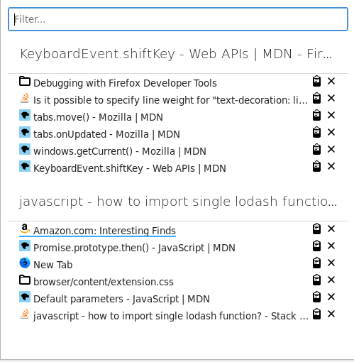

# Workspaces for Firefox

A Firefox Quantum extension designed to make interacting with tabs across
multiple Firefox windows, spread across different virtual desktops/workspaces,
easy.

[Get it from addons.mozilla.org](https://addons.mozilla.org/en-US/firefox/addon/workspaces-for-firefox/).

## Usage



Press **Alt-Space** to launch the Palette. In the Palette, you may search for a
tab, regardless of where it is. Press **Enter**, or click the tab, to switch to
it. Hold **Shift** while pressing **Enter**, or click the "paste" icon next to
the tab, to "teleport" the tab into the current window. The tab will be
transferred with no loss in history or other state. Finally, you can close tabs 
by clicking the close box at the right side of the tab in the list.

## Building

To build this extension, simply run:

```sh
$ yarn
$ yarn build
```

inside the project directory. It will create the output file
`web-ext-artifacts/workspaces_for_firefox-1.0.zip`.
